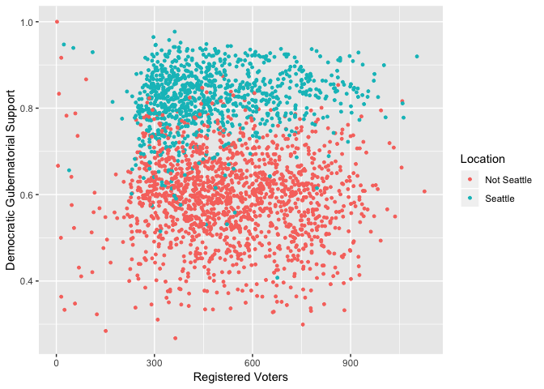
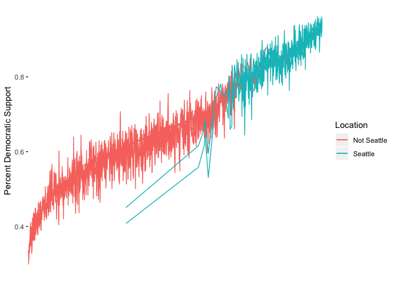

# Instructions

> Questions for you to answer are as quoted blocks of text. Put your code used to address these questions and interpretation below each block. Make sure your answers are NOT in block quotes like these. Load all libraries you want to use in the `setup` chunk; when you discover you want to lose a library later, add it to the setup chunk at the top. Part 1 is due Tuesday October 30th, at 11:59 PM. Part 2 is due Tuesday November 6th, at 11:59 PM. You will upload the entire template each time, with whatever progress you have made.

# Part 1

## Getting the data in

> Download the data from <https://raw.githubusercontent.com/clanfear/CSSS508/master/Homework/HW5/king_county_elections_2016.txt>. It is a plain text file of data, about 60 MB in size. Values are separated with commas (you can see this by opening it with a *good* text editor, e.g. not Notepad). Save it somewhere on your computer---in the same folder as this template is easiest---and read the file into R. You will want to use the `cache=TRUE` chunk option for this (and potentially other chunks). `cache=TRUE` will allow R to read the file only once to save time.


```r
# IMPORT YOUR DATA HERE; use cache=TRUE!
king <- read_csv("king_county_elections_2016.txt")
```

```
## Parsed with column specification:
## cols(
##   Precinct = col_character(),
##   Race = col_character(),
##   LEG = col_double(),
##   CC = col_double(),
##   CG = col_double(),
##   CounterGroup = col_character(),
##   Party = col_character(),
##   CounterType = col_character(),
##   SumOfCount = col_double()
## )
```

## Inspecting the data

> Use a function like `str()` or `glimpse()` to look at the data.  Describe the data in their current state. How many rows are there? What variables are there? What kinds of values do they take (don't list them all if there are many)? Are the column types sensible? 


```r
# [YOUR CODE HERE]
str(king)
```

```
## Classes 'spec_tbl_df', 'tbl_df', 'tbl' and 'data.frame':	643163 obs. of  9 variables:
##  $ Precinct    : chr  "ADAIR" "ADAIR" "ADAIR" "ADAIR" ...
##  $ Race        : chr  "Advisory Vote 14" "Advisory Vote 14" "Advisory Vote 14" "Advisory Vote 14" ...
##  $ LEG         : num  45 45 45 45 45 45 45 45 45 45 ...
##  $ CC          : num  3 3 3 3 3 3 3 3 3 3 ...
##  $ CG          : num  1 1 1 1 1 1 1 1 1 1 ...
##  $ CounterGroup: chr  "Total" "Total" "Total" "Total" ...
##  $ Party       : chr  "NP" "NP" "NP" "NP" ...
##  $ CounterType : chr  "Maintained" "Registered Voters" "Repealed" "Times Blank Voted" ...
##  $ SumOfCount  : num  183 519 251 51 485 0 220 519 222 43 ...
##  - attr(*, "spec")=
##   .. cols(
##   ..   Precinct = col_character(),
##   ..   Race = col_character(),
##   ..   LEG = col_double(),
##   ..   CC = col_double(),
##   ..   CG = col_double(),
##   ..   CounterGroup = col_character(),
##   ..   Party = col_character(),
##   ..   CounterType = col_character(),
##   ..   SumOfCount = col_double()
##   .. )
```
The King County 2016 election dataset has 643,163 rows and 9 columns. The 9 columns, the variables, are precincts, races, running official, and party, along with five other coded variables. It looks like each row/observation are the total counts in a precinct for an official or measure.


> In addition to looking generally, look at each variable individually... except consider `LEG`, `CC` and `CG` at the same time (I will tell you now these three aren't likely to be useful to you, but maybe guess what they are!). Remember these are real administrative data so they may be *really strangely structured* and some variables are indecipherable; in real world data work, you often have to get by with intuition or poking around online with regard to the nature of your data. Here useful way to look at 10 unique values of individual columns, given some `data` and a `variable` of interest:

```
data %>%
    select(variable) %>%
    distinct(variable) %>%
    head(10)
```

### Precinct


```r
# [YOUR CODE HERE]
king %>%
    select(Precinct) %>%
    distinct(Precinct) %>%
    head(10)
```

```
## # A tibble: 10 x 1
##    Precinct     
##    <chr>        
##  1 ADAIR        
##  2 ALDARRA      
##  3 ALDER SPRINGS
##  4 ALDERWOOD    
##  5 ALG 30-0013  
##  6 ALG 30-0014  
##  7 ALG 30-3141  
##  8 ALPINE       
##  9 AMES LAKE    
## 10 ANGEL CITY
```

### Race


```r
# [YOUR CODE HERE]
king %>%
    select(Race) %>%
    distinct(Race) %>%
    head(10)
```

```
## # A tibble: 10 x 1
##    Race                             
##    <chr>                            
##  1 Advisory Vote 14                 
##  2 Advisory Vote 15                 
##  3 Attorney General                 
##  4 Commissioner of Public Lands     
##  5 Congressional District 1         
##  6 Court of Appeals Judge Position 1
##  7 Governor                         
##  8 Initiative Measure 1433          
##  9 Initiative Measure 1464          
## 10 Initiative Measure 1491
```

### LEG, CC, CG


```r
# [YOUR CODE HERE]
king %>%
    select(LEG) %>%
    distinct(LEG) %>%
    head(10)
```

```
## # A tibble: 10 x 1
##      LEG
##    <dbl>
##  1    45
##  2     5
##  3    30
##  4    37
##  5    11
##  6    31
##  7    47
##  8    34
##  9    41
## 10    48
```

```r
king %>%
    select(CC) %>%
    distinct(CC) %>%
    head(10)
```

```
## # A tibble: 10 x 1
##       CC
##    <dbl>
##  1     3
##  2     7
##  3     2
##  4     9
##  5     8
##  6     6
##  7     1
##  8     5
##  9    NA
## 10     4
```

```r
king %>%
    select(CG) %>%
    distinct(CG) %>%
    head(10)
```

```
## # A tibble: 4 x 1
##      CG
##   <dbl>
## 1     1
## 2     8
## 3     9
## 4     7
```

### CounterGroup


```r
# [YOUR CODE HERE]
king %>%
    select(CounterGroup) %>%
    distinct(CounterGroup) %>%
    head(10)
```

```
## # A tibble: 1 x 1
##   CounterGroup
##   <chr>       
## 1 Total
```

### Party


```r
# [YOUR CODE HERE]
king %>%
    select(Party) %>%
    distinct(Party) %>%
    head(10)
```

```
## # A tibble: 10 x 1
##    Party
##    <chr>
##  1 NP   
##  2 Dem  
##  3 Lib  
##  4 Rep  
##  5 GP   
##  6 CPN  
##  7 DPN  
##  8 GPN  
##  9 LPN  
## 10 RPN
```

### CounterType


```r
# [YOUR CODE HERE]
king %>%
    select(CounterType) %>%
    distinct(CounterType) %>%
    head(10)
```

```
## # A tibble: 10 x 1
##    CounterType       
##    <chr>             
##  1 Maintained        
##  2 Registered Voters 
##  3 Repealed          
##  4 Times Blank Voted 
##  5 Times Counted     
##  6 Times Over Voted  
##  7 Bob Ferguson      
##  8 Joshua B. Trumbull
##  9 Write-In          
## 10 Hilary Franz
```

### SumOfCount


```r
# [YOUR CODE HERE]
king %>%
    select(SumOfCount) %>%
    distinct(SumOfCount) %>%
    head(10)
```

```
## # A tibble: 10 x 1
##    SumOfCount
##         <dbl>
##  1        183
##  2        519
##  3        251
##  4         51
##  5        485
##  6          0
##  7        220
##  8        222
##  9         43
## 10        357
```

## The quantities of interest

> We will focus on only the three major executive races in Washington in 2016:

> * President (and Vice-President)
> * Governor
> * Lieutenant Governor

> With these races, we are interested in:
> 1. **Turnout rates** for each of these races in each precinct. We will measure turnout as times votes were counted (including for a candidate, blank, write-in, or "over vote") divided by the number of registered voters.
> 2. Differences between precincts *in Seattle* and precincts *elsewhere in King County*. Again, these data are not documented, so you will have to figure out how to do this.
> 3. Precinct-level support for the Democratic candidates in King County in 2012 for each contest. We will measure support as the percentage of votes in a precinct for the Democratic candidate out of all votes for candidates or write-ins. Do not include blank votes or "over votes" (where the voter indicated multiple choices) in the overall vote count for the denominator.

> You will perform most of the data management for #1 and #2 in Part 1. Part 2 will contain most of the work for #3 and also covers visualizing results.

> The primary goal to accomplish over Parts 1 and 2 will be to get the data to one **row per precinct** with the following 7 columns:

> * Precinct identifier
> * Indicator for whether the precinct is in Seattle or not
> * Precinct size in terms of registered voters
> * Turnout rate
> * Percentage Democratic support for President
> * Percentage Democratic support for Governor
> * Percentage Democratic support for Lieutenant Governor

> The sections below describe steps you may want to do to get your data organized, and provide some hints and suggestions for methods, in particular using `dplyr` and `tidyr`.

## Filtering down the data

> For what we want to do, there are a lot of rows that are not useful. We only want ones pertaining to races for **President**, **Governor**, and **Lieutenant Governor**. So let's trim everything down. You will want to see how these things show up in the data. The easiest way may be to (1) display every unique value of `Race` and find which ones match our races of interest, then (2) filter the data to those races.


```r
# info on the distinct races
races <- king %>%
    select(Race) %>%
    distinct(Race) %>%
    arrange(Race)
# print it out as a character vector
as.character(races$Race)
```

```
##  [1] "Advisory Vote 14"                                            
##  [2] "Advisory Vote 15"                                            
##  [3] "Attorney General"                                            
##  [4] "Auburn School District No. 408 Proposition 1"                
##  [5] "City of Bellevue Proposition 1"                              
##  [6] "City of Bellevue Proposition 2"                              
##  [7] "City of Bothell Advisory Proposition 1"                      
##  [8] "City of Bothell Proposition 1"                               
##  [9] "City of Duvall Advisory Vote 1"                              
## [10] "City of Duvall Proposition 1"                                
## [11] "City of Issaquah Proposition 1"                              
## [12] "City of Kenmore Proposition 1"                               
## [13] "City of Seattle Initiative Measure 124"                      
## [14] "City of Shoreline Proposition 1"                             
## [15] "City of Snoqualmie Proposition 1"                            
## [16] "City of Tukwila Proposition 1"                               
## [17] "Commissioner of Public Lands"                                
## [18] "Congressional District 1"                                    
## [19] "Congressional District 7"                                    
## [20] "Congressional District 8"                                    
## [21] "Congressional District 9"                                    
## [22] "Court of Appeals Judge Position 1"                           
## [23] "District Court Southwest Electoral District Judge Position 3"
## [24] "District Court West Electoral District Judge Position 1"     
## [25] "District Court West Electoral District Judge Position 4"     
## [26] "Governor"                                                    
## [27] "Highline School District No. 401 Proposition 1"              
## [28] "Initiative Measure 1433"                                     
## [29] "Initiative Measure 1464"                                     
## [30] "Initiative Measure 1491"                                     
## [31] "Initiative Measure 1501"                                     
## [32] "Initiative Measure 732"                                      
## [33] "Initiative Measure 735"                                      
## [34] "Insurance Commissioner"                                      
## [35] "Kent School District No. 415 Proposition 1"                  
## [36] "King County Charter Amendment 1"                             
## [37] "King County Charter Amendment 2"                             
## [38] "King County Fire Protection District 27 Proposition 1"       
## [39] "Legislative District 1 Representative Position 1"            
## [40] "Legislative District 1 Representative Position 2"            
## [41] "Legislative District 1 State Senator"                        
## [42] "Legislative District 11 Representative Position 1"           
## [43] "Legislative District 11 Representative Position 2"           
## [44] "Legislative District 11 State Senator"                       
## [45] "Legislative District 30 Representative Position 1"           
## [46] "Legislative District 30 Representative Position 2"           
## [47] "Legislative District 31 Representative Position 1"           
## [48] "Legislative District 31 Representative Position 2"           
## [49] "Legislative District 32 Representative Position 1"           
## [50] "Legislative District 32 Representative Position 2"           
## [51] "Legislative District 33 Representative Position 1"           
## [52] "Legislative District 33 Representative Position 2"           
## [53] "Legislative District 34 Representative Position 1"           
## [54] "Legislative District 34 Representative Position 2"           
## [55] "Legislative District 36 Representative Position 1"           
## [56] "Legislative District 36 Representative Position 2"           
## [57] "Legislative District 36 State Senator"                       
## [58] "Legislative District 37 Representative Position 1"           
## [59] "Legislative District 37 Representative Position 2"           
## [60] "Legislative District 39 Representative Position 1"           
## [61] "Legislative District 39 Representative Position 2"           
## [62] "Legislative District 39 State Senator"                       
## [63] "Legislative District 41 Representative Position 1"           
## [64] "Legislative District 41 Representative Position 2"           
## [65] "Legislative District 41 State Senator"                       
## [66] "Legislative District 43 Representative Position 1"           
## [67] "Legislative District 43 Representative Position 2"           
## [68] "Legislative District 45 Representative Position 1"           
## [69] "Legislative District 45 Representative Position 2"           
## [70] "Legislative District 46 Representative Position 1"           
## [71] "Legislative District 46 Representative Position 2"           
## [72] "Legislative District 47 Representative Position 1"           
## [73] "Legislative District 47 Representative Position 2"           
## [74] "Legislative District 48 Representative Position 1"           
## [75] "Legislative District 48 Representative Position 2"           
## [76] "Legislative District 5 Representative Position 1"            
## [77] "Legislative District 5 Representative Position 2"            
## [78] "Legislative District 5 State Senator"                        
## [79] "Lieutenant Governor"                                         
## [80] "Proposed Eastside Regional Fire Authority Proposition 1"     
## [81] "Secretary of State"                                          
## [82] "Senate Joint Resolution 8210"                                
## [83] "Sound Transit Proposition 1"                                 
## [84] "South King Fire and Rescue Proposition 1"                    
## [85] "State Auditor"                                               
## [86] "State Supreme Court Justice Position 1"                      
## [87] "State Supreme Court Justice Position 5"                      
## [88] "State Supreme Court Justice Position 6"                      
## [89] "State Treasurer"                                             
## [90] "Superintendent of Public Instruction"                        
## [91] "Superior Court Judge Position 14"                            
## [92] "Superior Court Judge Position 26"                            
## [93] "Superior Court Judge Position 31"                            
## [94] "Superior Court Judge Position 44"                            
## [95] "Superior Court Judge Position 52"                            
## [96] "Superior Court Judge Position 53"                            
## [97] "US President & Vice President"                               
## [98] "US Senator"
```


```r
# make a character vector of relevant races
(rel_races <- races$Race[c(26, 79, 97)])
```

```
## [1] "Governor"                      "Lieutenant Governor"          
## [3] "US President & Vice President"
```


```r
# subset the data to relevant races
(king_rel_races <- king %>%
    filter(Race %in% rel_races))
```

```
## # A tibble: 65,442 x 9
##    Precinct Race    LEG    CC    CG CounterGroup Party CounterType
##    <chr>    <chr> <dbl> <dbl> <dbl> <chr>        <chr> <chr>      
##  1 ADAIR    Gove…    45     3     1 Total        Dem   Jay Inslee 
##  2 ADAIR    Gove…    45     3     1 Total        NP    Registered…
##  3 ADAIR    Gove…    45     3     1 Total        NP    Times Blan…
##  4 ADAIR    Gove…    45     3     1 Total        NP    Times Coun…
##  5 ADAIR    Gove…    45     3     1 Total        NP    Times Over…
##  6 ADAIR    Gove…    45     3     1 Total        NP    Write-In   
##  7 ADAIR    Gove…    45     3     1 Total        Rep   Bill Bryant
##  8 ADAIR    Lieu…    45     3     1 Total        Dem   Cyrus Habib
##  9 ADAIR    Lieu…    45     3     1 Total        NP    Registered…
## 10 ADAIR    Lieu…    45     3     1 Total        NP    Times Blan…
## # … with 65,432 more rows, and 1 more variable: SumOfCount <dbl>
```


## Seattle precincts

> We want to determine which precincts are in Seattle and which are not. You will probably want to look at values of the `Precinct` variable and see if you can figure out what uniquely identifies Seattle precincts. You will then want to create a binary variable that identifies Seattle tracts (for instance, with values `"Seattle"` and `"Not Seattle"`). Hint: You can use `substr()` to grab a number of characters---a sub-string---from text (say, to test if they equal something); if you use this with `ifelse()` inside `mutate()` you can make a new variable based on whether the sub-string of `Precinct` equals a value.


```r
# [YOUR CODE HERE]
(precincts <- king_rel_races %>%
    select(Precinct) %>%
    distinct(Precinct) %>%
    arrange(Precinct))
```

```
## # A tibble: 2,517 x 1
##    Precinct     
##    <chr>        
##  1 ADAIR        
##  2 ALDARRA      
##  3 ALDER SPRINGS
##  4 ALDERWOOD    
##  5 ALG 30-0013  
##  6 ALG 30-0014  
##  7 ALG 30-3141  
##  8 ALPINE       
##  9 AMES LAKE    
## 10 ANGEL CITY   
## # … with 2,507 more rows
```


```r
king_flag <- king_rel_races %>%
    mutate(Location = ifelse(substr(Precinct, start = 1, stop = 4) == "SEA ",
                             "Seattle",
                             "Not Seattle"))
```


## Registered voters and turnout rates

> We want to calculate turnout rates as total votes (including normal votes, blank votes, over votes, write-ins) for the Presidential race divided by registered voters.  Hint: You will want to look at `CounterType` and `SumOfCount` at the same time, within each `Precinct` and `Race`. Examine how the `SumOfCount` values for `CounterType` value `"Times Counted"` relate to all the other `CounterType` values.


```r
# sum over rows besides "Registered Voters" or "Times Counted"
# within each precinct and race
times_counted_manual <- king_flag %>%
    select(Precinct, Race, CounterType, SumOfCount) %>%
    filter(CounterType != "Registered Voters" & CounterType != "Times Counted") %>%
    group_by(Precinct, Race) %>%
    summarize(votes_added_up = sum(SumOfCount))
head(times_counted_manual)
```

```
## # A tibble: 6 x 3
## # Groups:   Precinct [2]
##   Precinct Race                          votes_added_up
##   <chr>    <chr>                                  <dbl>
## 1 ADAIR    Governor                                 485
## 2 ADAIR    Lieutenant Governor                      485
## 3 ADAIR    US President & Vice President            485
## 4 ALDARRA  Governor                                 625
## 5 ALDARRA  Lieutenant Governor                      625
## 6 ALDARRA  US President & Vice President            625
```


```r
# now just grab the "Times Counted" rows and merge
times_counted_compare <- king_flag %>%
    select(Precinct, Race, CounterType, SumOfCount) %>%
    filter(CounterType == "Times Counted") %>%
    # rename the column on filtered data for clarity
    rename(times_counted_value = SumOfCount) %>%
    left_join(times_counted_manual,
              by = c("Precinct", "Race")) %>%
    # compute differences
    mutate(diff = times_counted_value - votes_added_up)

summary(times_counted_compare$diff)
```

```
##    Min. 1st Qu.  Median    Mean 3rd Qu.    Max. 
##       0       0       0       0       0       0
```

```r
turnout_rates <- king_flag %>%
    # filter to just the presidential election
    filter(Race == rel_races[3]) %>%
    # filter to just registered voters or times counted
    filter(CounterType %in% c("Registered Voters", "Times Counted")) %>%
    # just the columns we want
    select(Precinct, Location, CounterType, SumOfCount) %>%
    # use spread to put the two counts on the same row for each precinct
    spread(key = CounterType, value = SumOfCount) %>%
    # use new columns to compute turnout rate
    mutate(Turnout = `Times Counted` / `Registered Voters`)
head(turnout_rates)
```

```
## # A tibble: 6 x 5
##   Precinct      Location    `Registered Voters` `Times Counted` Turnout
##   <chr>         <chr>                     <dbl>           <dbl>   <dbl>
## 1 ADAIR         Not Seattle                 519             485   0.934
## 2 ALDARRA       Not Seattle                 763             625   0.819
## 3 ALDER SPRINGS Not Seattle                 557             476   0.855
## 4 ALDERWOOD     Not Seattle                 472             404   0.856
## 5 ALG 30-0013   Not Seattle                 497             319   0.642
## 6 ALG 30-0014   Not Seattle                 525             364   0.693
```

# Part 2

## Democratic support rates

> We want to get measures of democratic support in each Precinct for each of our three races. You are asked to measure support as the *percentage of votes* in a precinct for the Democratic candidate *out of all votes for candidates or write-ins*, but this time *do not to include blank votes or "over votes"* (where the voter indicated multiple choices) in the overall vote count for the denominator. Hint: A good approach here is to compute the denominator (total votes) for each precinct, and then *merge* (e.g. `left_join()`) on the Democratic vote count for each race and divide by the total votes.

### Computing candidate votes

> You will probably want to follow a process like this:

> 1. Make a new dataframe with the total number of votes cast for any actual candidates (including `"Write-In"`) in each precinct and race. Hint: You will likely want to use `filter()` followed by `group_by()` and `summarize()` using the `SumOfCount` variable.

> 2. Make another dataframe with the total number of votes for democratic candidates in each precinct and race. You will want to check the `Party` of candidates and work only with the democratic observations to get these vote counts. Hint: There are different democratic parties for different races (e.g. `"Dem"` or `"DPN"`).

> 3. Merge the total votes data with the democratic votes data, then calculate a percent democratic votes variable for each race.


```r
# [YOUR CODE HERE]
votesbyparty = king_rel_races %>% 
  filter(CounterType != "Times Blank Voted" & 
           CounterType != "Registered Voters" & 
           CounterType != "Times Counted" & 
           CounterType != "Times Over Voted") %>%
  group_by(Precinct, Race, Party) %>%
  summarize(SumOfCount) %>%
  select(Precinct, Race, Party, SumOfCount)%>%
  group_by(Precinct, Race) %>%
  mutate(Demvotes = 
         ifelse(Party == "Dem" | Party == "DPN",SumOfCount,0)) %>%
  mutate(Totalvotes = sum(SumOfCount)) %>%
  mutate(Demsupport = Demvotes / Totalvotes) %>%
  filter(Demsupport!=0)
votesbyparty
```

```
## # A tibble: 7,543 x 7
## # Groups:   Precinct, Race [7,543]
##    Precinct   Race          Party SumOfCount Demvotes Totalvotes Demsupport
##    <chr>      <chr>         <chr>      <dbl>    <dbl>      <dbl>      <dbl>
##  1 ADAIR      Governor      Dem          256      256        481      0.532
##  2 ADAIR      Lieutenant G… Dem          258      258        473      0.545
##  3 ADAIR      US President… DPN          266      266        473      0.562
##  4 ALDARRA    Governor      Dem          290      290        603      0.481
##  5 ALDARRA    Lieutenant G… Dem          301      301        580      0.519
##  6 ALDARRA    US President… DPN          334      334        612      0.546
##  7 ALDER SPR… Governor      Dem          206      206        450      0.458
##  8 ALDER SPR… Lieutenant G… Dem          215      215        429      0.501
##  9 ALDER SPR… US President… DPN          235      235        465      0.505
## 10 ALDERWOOD  Governor      Dem          201      201        387      0.519
## # … with 7,533 more rows
```

## Combining it all

> Once you've calculated democratic voting percentages for *each race* you'll want to put them back together with the precinct turnout rate data using a **join**. Then you will want to make sure your data are shaped as I recommend above: One row per precincts, with columns for each of the relevant measures. If your data are in a format where you have a row for each race within each precinct ("long format"), you may find the `spread()` command useful for turning multiple rows for each precinct into single precinct rows with different columns for each race.


```r
# [YOUR CODE HERE]
(spreadvotes = votesbyparty %>%
  select(Precinct,Race,Demsupport) %>%
  spread(key= Race, value = Demsupport))
```

```
## # A tibble: 2,515 x 4
## # Groups:   Precinct [2,515]
##    Precinct      Governor `Lieutenant Governo… `US President & Vice Presid…
##    <chr>            <dbl>                <dbl>                        <dbl>
##  1 ADAIR            0.532                0.545                        0.562
##  2 ALDARRA          0.481                0.519                        0.546
##  3 ALDER SPRINGS    0.458                0.501                        0.505
##  4 ALDERWOOD        0.519                0.564                        0.611
##  5 ALG 30-0013      0.557                0.539                        0.470
##  6 ALG 30-0014      0.602                0.551                        0.504
##  7 ALG 30-3141      0.439                0.428                        0.439
##  8 ALPINE           0.483                0.496                        0.527
##  9 AMES LAKE        0.522                0.581                        0.577
## 10 ANGEL CITY       0.795                0.798                        0.782
## # … with 2,505 more rows
```


```r
final=spreadvotes %>% left_join(turnout_rates)
```

```
## Joining, by = "Precinct"
```

```r
names(final)[6]<-"Registered"
names(final)[4]<-"President"
names(final)[3]<-"LT"
final
```

```
## # A tibble: 2,515 x 8
## # Groups:   Precinct [2,515]
##    Precinct Governor    LT President Location Registered `Times Counted`
##    <chr>       <dbl> <dbl>     <dbl> <chr>         <dbl>           <dbl>
##  1 ADAIR       0.532 0.545     0.562 Not Sea…        519             485
##  2 ALDARRA     0.481 0.519     0.546 Not Sea…        763             625
##  3 ALDER S…    0.458 0.501     0.505 Not Sea…        557             476
##  4 ALDERWO…    0.519 0.564     0.611 Not Sea…        472             404
##  5 ALG 30-…    0.557 0.539     0.470 Not Sea…        497             319
##  6 ALG 30-…    0.602 0.551     0.504 Not Sea…        525             364
##  7 ALG 30-…    0.439 0.428     0.439 Not Sea…        551             364
##  8 ALPINE      0.483 0.496     0.527 Not Sea…        629             513
##  9 AMES LA…    0.522 0.581     0.577 Not Sea…        865             726
## 10 ANGEL C…    0.795 0.798     0.782 Not Sea…        779             546
## # … with 2,505 more rows, and 1 more variable: Turnout <dbl>
```


## Graphing the results

### Turnout

> Make a scatterplot where the horizontal axis is number of registered voters in the precinct, and the vertical axis is turnout rate. Color the precincts in Seattle one color, and use a different color for other precincts. Do you observe anything?


```r
# [YOUR CODE HERE]
#source1="" #source
#titlecount="" #title for the plot

scatter=ggplot(final, aes(Registered,Governor, color=Location)) +
  geom_point(size = 1) +
   xlab("Registered Voters") + 
  ylab("Democratic Gubernatorial Support")
scatter
```

```
## Warning: Removed 1 rows containing missing values (geom_point).
```

<!-- -->
Looks like people in Seattle heavily favored the democratic gubernatorial candidate.

### Democratic support

> Now let's visualize the Democratic support rates for the three races within each precinct for sufficently large precincts. Limit the data to precincts with at least 500 registered voters. Make a line plot where the horizontal axis indicates precincts, and the vertical axis shows the Democratic support rates. There should be three lines in different colors (one for each race of interest).

> **Do not** *label* the precincts on the horizontal axis (you will probably have to search to figure out how). You should, however, *arrange them on the axis in order from smallest to largest* in terms of support for the Democratic candidate for president --- that is, the line plotting percentage support for Obama should be smoothly increasing from left to right. The order of the lines in the legend should follow the order of the lines at the right edge of the plot.

> To do this, we need to use the "wide" version of the data (one row per precinct), and order `Precinct` based on Democratic support for the Presidential race (Hint: You will probably want to use `fct_reorder()` on `Precinct`). Then we can reshape back from "wide" to "tidy" form using `gather()` so that we have one variable giving the race---and another giving vote percentage---and can plot a separate line for each race.


```r
# [YOUR CODE HERE]
final2 = final %>% 
  filter(Registered > 500)
final2
```

```
## # A tibble: 1,188 x 8
## # Groups:   Precinct [1,188]
##    Precinct Governor    LT President Location Registered `Times Counted`
##    <chr>       <dbl> <dbl>     <dbl> <chr>         <dbl>           <dbl>
##  1 ADAIR       0.532 0.545     0.562 Not Sea…        519             485
##  2 ALDARRA     0.481 0.519     0.546 Not Sea…        763             625
##  3 ALDER S…    0.458 0.501     0.505 Not Sea…        557             476
##  4 ALG 30-…    0.602 0.551     0.504 Not Sea…        525             364
##  5 ALG 30-…    0.439 0.428     0.439 Not Sea…        551             364
##  6 ALPINE      0.483 0.496     0.527 Not Sea…        629             513
##  7 AMES LA…    0.522 0.581     0.577 Not Sea…        865             726
##  8 ANGEL C…    0.795 0.798     0.782 Not Sea…        779             546
##  9 ANGELO      0.453 0.458     0.448 Not Sea…        501             392
## 10 ARTHUR      0.405 0.426     0.425 Not Sea…        901             739
## # … with 1,178 more rows, and 1 more variable: Turnout <dbl>
```


```r
lineplot=ggplot(final2, aes(x=fct_reorder(Precinct,President),y=President,group=Location,color=Location)) +
   geom_line() +
  geom_line(aes(y=Governor)) +
  geom_line(aes(y=LT)) +
   theme(axis.title.x=element_blank(),
        axis.text.x=element_blank(),
        axis.ticks.x=element_blank(),)+
  labs(y = "Percent Democratic Support",
                x = "Precincts Ordered by Percent Support for Democratic Presidential Nominee")
lineplot
```

<!-- -->
